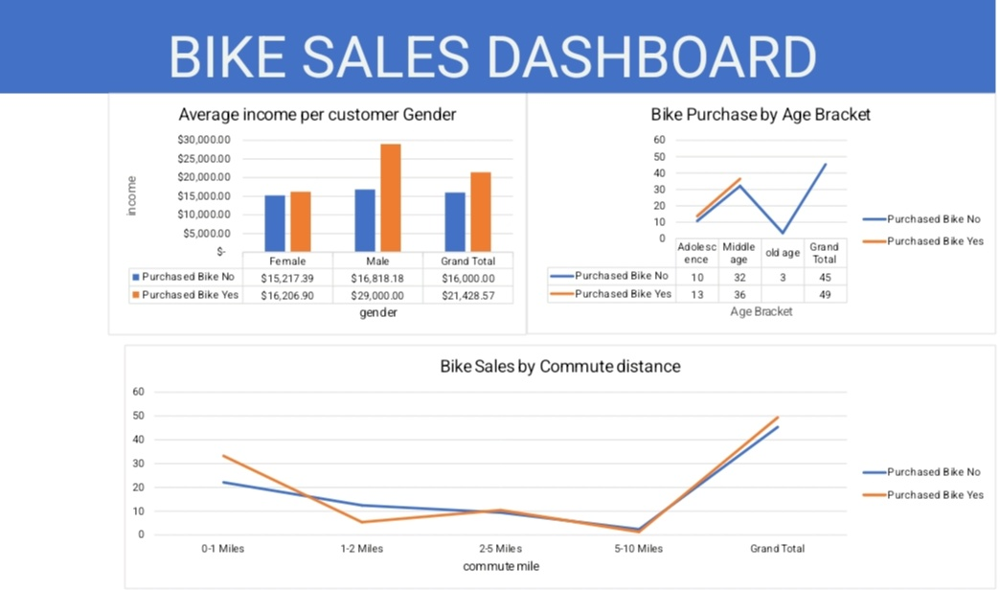

# Bike Sales Analysis Using Excel

## Project Overview

This is a beginner data analysis project where I used Microsoft Excel to analyze customer bike purchasing behaviour.

The project helped me practice data cleaning, PivotTables, charts, and dashboard creation.

I analyzed customer information such as age, gender, income, occupation, commute distance, region, and bike purchase status to understand patterns in bike purchasing.

## Business Problem

The goal of this project was to understand customer characteristics associated with bike purchases.

The analysis focuses on questions such as:

- How many customers purchased a bike?
- Which age group has the most bike purchases?
- Is there a difference in purchasing behaviour between male and female customers?
- Which commute distance has the highest bike purchase rate?
- Which regions have stronger bike purchasing activity?

The results can help a bike-selling business better understand its customers and identify groups with stronger purchasing activity.

## Dataset

The dataset contains **1,026 customer records** and includes information such as:

- Gender
- Age
- Income
- Education
- Occupation
- Commute Distance
- Region
- Marital Status
- Purchased Bike

The dataset was used to explore customer characteristics and identify patterns in bike purchases.

## Tools Used

- **Microsoft Excel** — used for data cleaning, analysis, PivotTables, charts, and dashboard creation.
- **PivotTables** — used to summarize and analyze the data.
- **PivotCharts** — used to visualize the results.
- **Slicers** — used to make the dashboard interactive.

## Data Cleaning

Before analyzing the data, I checked the dataset to make sure it was ready for analysis.

The cleaning process included:

- Checking the data for duplicate records.
- Checking for blank or missing values.
- Checking that the data was in the correct format.
- Standardizing text values where necessary.
- Reviewing the age and income columns for values suitable for analysis.
- Checking the **Purchased Bike** column for consistent categories.

After cleaning the data, I used the dataset for my PivotTables, charts, and dashboard.

## Analysis

After cleaning the data, I used Excel PivotTables to summarize the information and look for patterns in bike purchases.

I analyzed the data based on:

- Age group
- Gender
- Income
- Commute distance
- Region
- Bike purchase status

I then created charts from the PivotTables to make the results easier to understand.

I also added slicers for **Occupation, Education, and Marital Status** so users can filter the dashboard and explore different customer groups.

### Questions I wanted to answer

1. How many customers purchased a bike?
2. Which age group has the most bike purchases?
3. How does bike purchasing compare between male and female customers?
4. Which commute distance has the highest purchase activity?
5. Which regions have stronger bike purchasing activity?

## Key Insights

After analyzing the data, I found the following:

- **495 out of 1,026 customers purchased a bike**, which is about **48.2%** of the customers.
- **Middle-aged customers had the highest number of bike purchases** compared with the other age groups.
- Customers with a **2–5 mile commute had the highest bike purchase rate**, at about **58.6%**.
- Bike purchasing was almost evenly split by gender. Female customers had a purchase rate of about **48.5%**, while male customers had about **48.0%**.
- The **Pacific region had the highest bike purchase rate**, at about **58.9%**.

## Recommendations

Based on the analysis, I would recommend that a bike-selling business:

- Focus more marketing efforts on **middle-aged customers**, since they recorded the highest number of bike purchases.
- Consider targeting customers with **2–5 mile commutes**, as this group had the highest purchase rate.
- Avoid focusing marketing only on one gender because the purchase rates for male and female customers were very similar.
- Explore the reasons for the higher purchase activity in the **Pacific region** and consider whether successful strategies from that region could be useful elsewhere.

These recommendations are based on the patterns found in this dataset and would need further analysis before making major business decisions.

## Dashboard

I created an interactive Excel dashboard to present the results of the analysis.

The dashboard includes:

- Bike purchase analysis by age group
- Average income by gender and purchase status
- Bike purchases by commute distance
- Slicers for Occupation, Education, and Marital Status

The slicers allow users to filter the dashboard and explore different customer groups.

## Conclusion

This project helped me practice using Excel for data analysis. I worked with customer and bike purchase data, checked and prepared the data, used PivotTables to analyze the information, and created an interactive dashboard.

Through the project, I learned how to turn data into charts and simple insights that can help answer business questions.

As a beginner in data analytics, this project is part of my journey toward developing stronger skills in Excel, Power BI, SQL, and other data analysis tools.

## Project Files

-`Bike_Sales_Analysis_Project .xlsx` — Excel workbook containing the analysis and dashboard.
- `images/bike-sales-dashboard.jpg` — dashboard preview.
